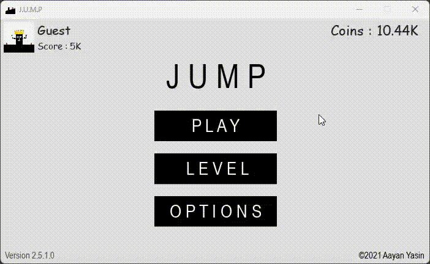
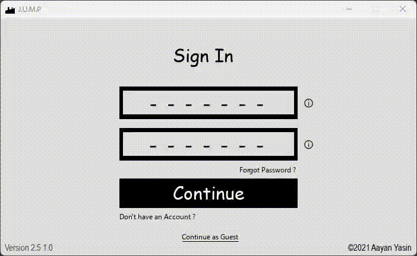
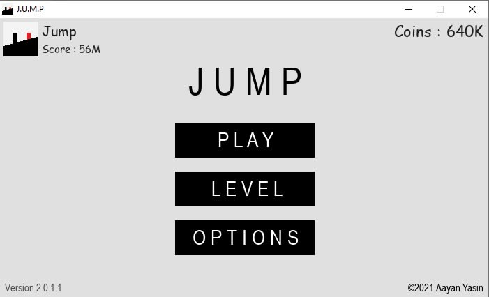
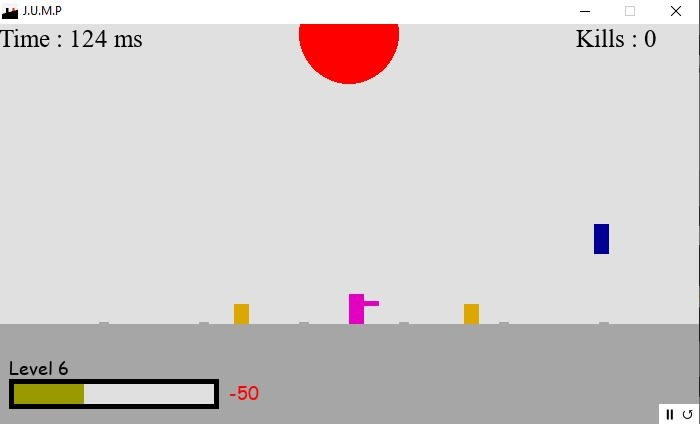
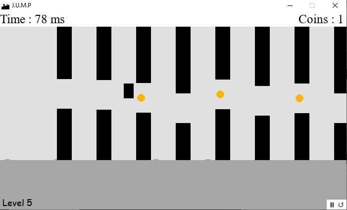
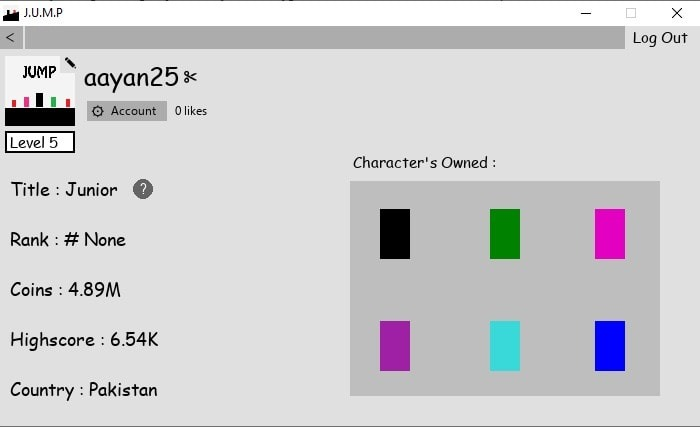

  

# J.U.M.P - 2D Platformer & Custom Engine

Built entirely from scratch in Python, this project is a demonstration of raw programming logic, custom physics mathematics, and full-stack database integration. 

Rather than relying on pre-built engines like Unity or Godot, I built the underlying mechanics, state management, and cloud backend manually to deeply understand how complex systems interact under the hood.

## 🚀 Technical Engineering Highlights

### 1. Custom Physics & Collision Mathematics
* Built a lightweight physics system handling gravity, vector-based movement, and terminal velocity.
* Engineered custom AABB (Axis-Aligned Bounding Box) collision detection using raw Pygame Rects to handle interactions between the player, moving platforms, and dynamic projectiles.

### 2. Full-Stack Backend Integration (MongoDB)
* Connected the local Python client to a live **MongoDB** cluster using `pymongo`.
* Built a real-time global leaderboard that fetches and sorts high scores.
* Implemented cloud-saving, allowing players to retain their coins, unlocked skins, and account level progress across different sessions.

### 3. Secure Authentication & Email OTP

* Developed a complete user authentication system from scratch (Sign Up, Log In, Log Out).
* Built a secure password recovery system that generates a 6-digit OTP and emails it directly to the user using Python's `smtplib` and SSL contexts.

### 4. Complex State Management
* Handled the memory and state transitions for 6 completely distinct levels with different mechanics (running, dodging, shooting, flying, and boss fights).
* Engineered a seamless UI system for pausing, menus, shops, and dynamic health bars without dropping the game's frame rate.

## 🛠️ Tech Stack
* **Core Logic:** Python
* **Rendering & UI:** Pygame, Tkinter 
* **Database & Cloud:** MongoDB Atlas (`pymongo`)
* **Networking & Security:** `smtplib`, `ssl`, `bs4`, `urllib`

## 🎮 The Gameplay
J.U.M.P tests reflexes and adaptability across 6 unique levels, each introducing a new mechanic:
* **Level 1-3:** Precision platforming and dodging complex moving obstacles.
* **Level 4:** Introduction of shooting mechanics and dynamic health management.
* **Level 5:** Vertical flying/ascending mechanics requiring precise altitude control.
* **Level 6:** A chaotic combination of all previous mechanics into a final survival test.

---

## 🖼️ Gameplay & Level Mechanics
*A look at the different stages, UI, and mechanics built into the engine:*

  <video src="showcase/1.mp4" controls="controls" width="100%"></video>
  &nbsp;&nbsp;&nbsp;
  
  &nbsp;&nbsp;&nbsp;
  
  &nbsp;&nbsp;&nbsp;
  
  &nbsp;&nbsp;&nbsp;
  

---
*Note: This project was built as a standalone logic and full-stack integration test. All core algorithms and database connections were hand-coded.*

